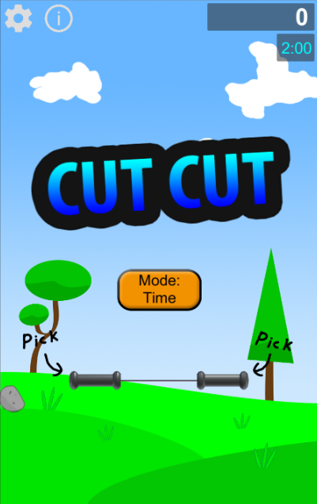
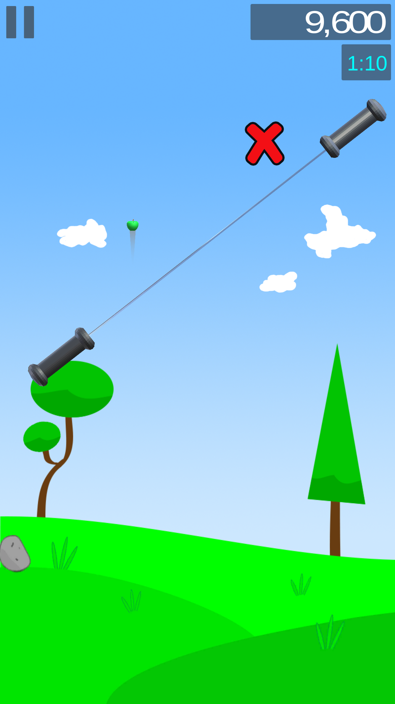
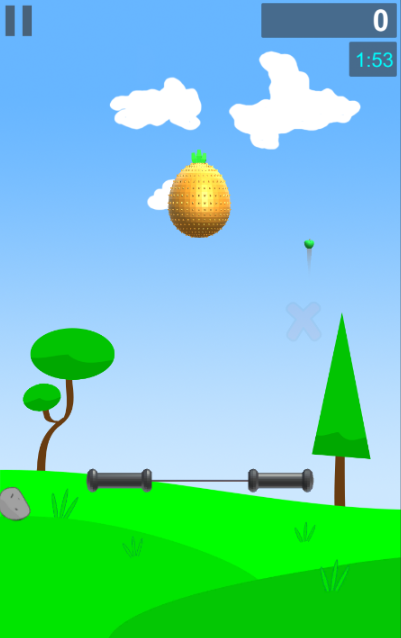

# CutCut
This my third game 😉

## Here some screenshots 📱
          

## What Have I Learned 📖
+Using 3D Objects in Unity  
+To make an 3D Object, using Blender 
+Orginizing folders, objects (but not definitely in Coding there is a still chaos 😐) 
+Optimizing game for all phones, for all screen combinations

